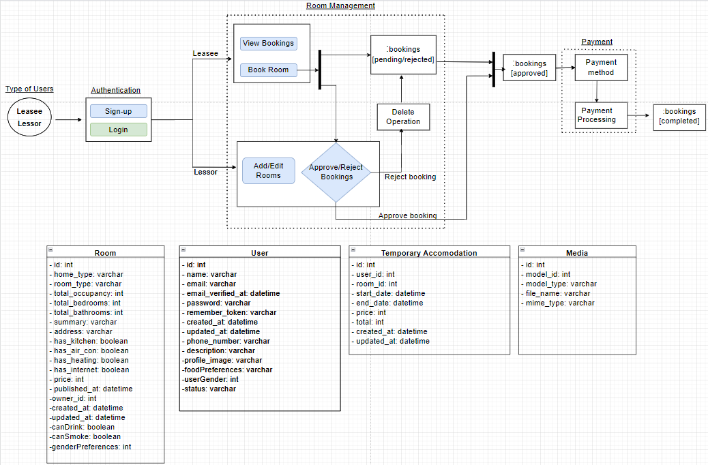

<!-- TABLE OF CONTENTS -->

 ## Table of Contents
  <ol>
    <li>
      <a href="#about-the-project">About The Project</a>
      <ul>
        <li><a href="#team-details">Team Details</a></li>
        <li><a href="#user-requirements">User Requirements</a></li>
        <li><a href="#modules">Modules</a></li>
        <li><a href="#domain-model">Domain Model</a></li>
        <!-- <li><a href="#built-with">Built With</a></li> -->
      </ul>
    </li>
  </ol>

<!-- ABOUT THE PROJECT -->
## About The Project

 Most incoming Northeastern university freshmen tend to face a common problem of having to make expensive interim accomodation arrangements (hotels/AirBnB) between the date of their arrival, and their lease contract's move-in date.

 **'BeMyGuest'** is a full-stack application that intends to provide a marketplace for leasing out rooms on a short-term/temporary basis at an affordable price to incoming university freshmen, from willing university connections who have vacancies at their homes. 

### Team Details
| Member name                    | Member email                       |
| :----------------------------- | :----------------------------------| 
| Akash Bharadwaj Karthik &nbsp; | bharadwajkarthik.a@northeastern.edu|
| Abhilash Gade                  | gade.ab@northeastern.edu           |   
| Srikanth Chilaka               | chilaka.s@northeastern.edu         | 
| Ratnesh Chimnani               | chimnani.r@northeastern.edu        |    

<a href="#readme-top">(back to top)</a>

### User Requirements
The high-level user requirements for the project are as follows:
1. Leasee(buyer of rooms) and Lessor(sellor of rooms) must be authenticated/authorized to perform role-related tasks.
2. Leasee must be able to book/view rooms based on preferences
3. Lessor must be able to add/edit rooms, and approve/reject booking requests from leasee
4. Leasee must be able to process payment on approved booking requests and complete booking

<a href="#readme-top">(back to top)</a>

### Modules
The project consists of 3 main modules to achieve user requirements:

* **Authentication** module which consists of the sign-up/login functionalities to authenticate and authorize users of two distinct types - Leasee (buyer of rooms) and Lessor (seller of rooms)
* **Room Management** module which consists of CRUD functionalities being performed on rooms; the leasee can view/book rooms; and the lessor can add/edit rooms and approve/deny booking requests 
* **Payment** module which deals with choosing method of payment and processing room payments to complete booking status.

<a href="#readme-top">(back to top)</a>

### Domain Model

